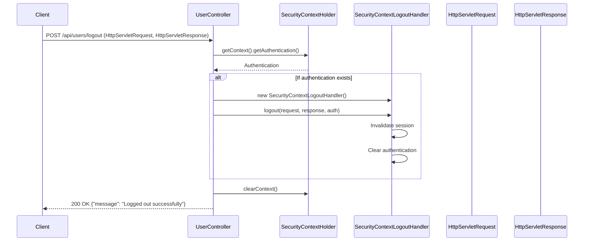

## Logout Sequence Diagram

## 로그아웃 (POST `/api/users/logout`)

| 항목 | 흐름 요약 | 핵심 비즈니스 로직 |
|:---|:---|:---|
| **목표** | 사용자 세션 종료 및 인증 정보 삭제 | - |
| **요청 수신** | `Client`가 로그아웃을 요청하면 `Controller`는 `HttpServletRequest`와 `HttpServletResponse`를 받습니다. | - |
| **인증 정보 확인** | `Controller`는 `SecurityContextHolder`에서 **현재 인증 정보를 조회**합니다. | - |
| **세션 무효화** | 인증 정보가 존재하면 `SecurityContextLogoutHandler`가 **세션을 무효화**하고 **인증 정보를 삭제**합니다. | **세션 무효화** |
| **컨텍스트 정리** | `SecurityContextHolder`의 **컨텍스트를 완전히 제거**합니다. | 인증 상태 완전 제거 |
| **응답 반환** | `Controller`는 로그아웃 성공 메시지를 `Client`에게 **HTTP 200 OK** 응답과 함께 반환합니다. | - |
