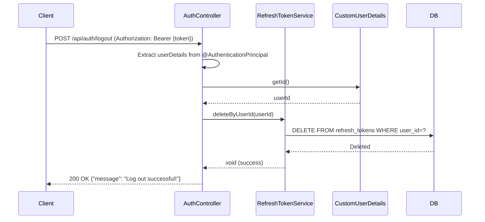

## Logout Sequence Diagram

## 로그아웃 (POST `/api/auth/logout`)

| 항목 | 흐름 요약 | 핵심 비즈니스 로직 |
|:---|:---|:---|
| **목표** | 사용자 Refresh Token 삭제 및 로그아웃 처리 | - |
| **컨트롤러 변경** | 로그아웃 엔드포인트가 `UserController`에서 **AuthController로 이동**되었습니다. | 인증 관련 API 분리 |
| **요청 수신** | `Client`가 **JWT Access Token을 포함**하여 로그아웃을 요청하면 `AuthController`는 `@AuthenticationPrincipal`을 통해 **현재 인증된 사용자 정보를 추출**합니다. | **JWT 기반 사용자 식별** |
| **사용자 ID 추출** | `CustomUserDetails`에서 **userId**를 가져옵니다. | - |
| **Refresh Token 삭제** | `RefreshTokenService`의 `deleteByUserId`를 호출하여 **DB에 저장된 Refresh Token을 삭제**합니다. | **JWT 토큰 무효화 (Refresh Token 제거)** |
| **응답 반환** | `Controller`는 로그아웃 성공 메시지를 `Client`에게 **HTTP 200 OK** 응답과 함께 반환합니다. | - |