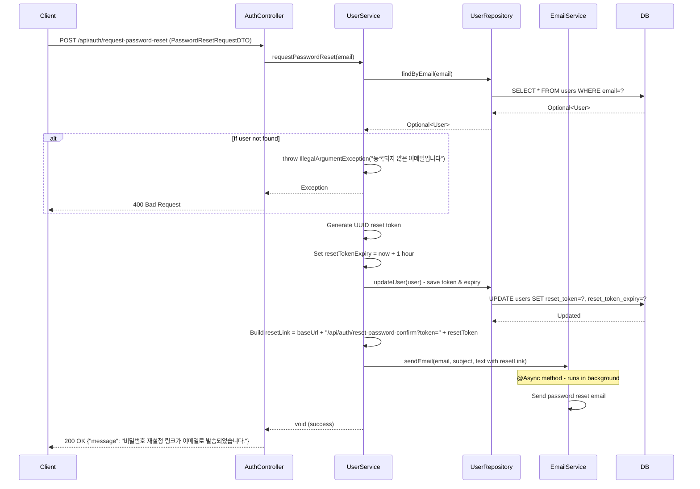

## Password Reset Request Sequence Diagram

## 비밀번호 재설정 요청 (POST `/api/auth/request-password-reset`)

| 항목 | 흐름 요약 | 핵심 비즈니스 로직 |
|:---|:---|:---|
| **목표** | 비밀번호를 잊은 사용자에게 재설정 링크 발송 | - |
| **요청 수신** | `Client`가 이메일 주소를 전달하면 `AuthController`는 `UserService`로 전달합니다. | - |
| **사용자 조회** | `UserRepository`의 `findByEmail`을 통해 **해당 이메일로 가입된 사용자가 존재하는지** 확인합니다. | **이메일 존재 확인** (예외 처리) |
| **재설정 토큰 생성** | `UUID.randomUUID()`를 통해 **고유한 재설정 토큰**을 생성합니다. | 보안 토큰 생성 |
| **토큰 만료 시간 설정** | `resetTokenExpiry`를 **현재 시간 + 1시간**으로 설정합니다. | 토큰 유효 기간 제한 |
| **DB 저장** | `resetToken`과 `resetTokenExpiry`를 User 엔티티에 저장합니다. | 토큰 영속화 |
| **재설정 링크 생성** | 프론트엔드 URL과 토큰을 조합하여 **재설정 링크**를 생성합니다. | - |
| **이메일 발송** | `EmailService`를 통해 **재설정 링크가 포함된 이메일**을 비동기로 발송합니다. | 비동기 이메일 전송 |
| **응답 반환** | 성공 메시지를 `Client`에게 **HTTP 200 OK** 응답과 함께 반환합니다. | - |