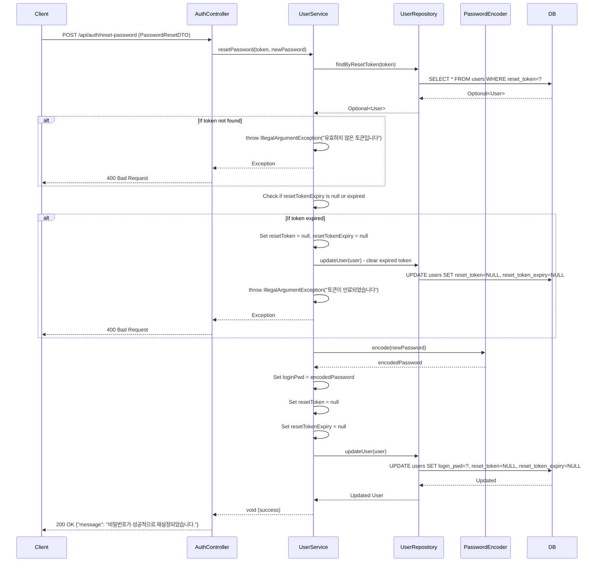

## Password Reset Sequence Diagram

## 비밀번호 재설정 처리 (POST `/api/auth/reset-password`)

| 항목 | 흐름 요약 | 핵심 비즈니스 로직 |
|:---|:---|:---|
| **목표** | 재설정 토큰을 검증하고 새로운 비밀번호로 변경 | - |
| **요청 수신** | `Client`가 재설정 토큰과 새로운 비밀번호를 전달하면 `AuthController`는 `PasswordResetDTO`를 통해 `UserService`로 전달합니다. | - |
| **토큰으로 사용자 조회** | `UserRepository`의 `findByResetToken`을 통해 **해당 토큰으로 저장된 사용자를 조회**합니다. | **토큰 존재 확인** |
| **토큰 만료 확인** | `resetTokenExpiry`를 확인하여 **토큰이 만료되지 않았는지** 검증합니다. | **시간 기반 토큰 유효성 검증** |
| **만료 토큰 정리** | 토큰이 만료된 경우 **DB에서 토큰을 삭제**하고 예외를 발생시킵니다. | 만료된 토큰 정리 |
| **비밀번호 암호화** | `PasswordEncoder`를 사용하여 새로운 비밀번호를 **암호화**합니다. | 보안을 위한 비밀번호 해싱 |
| **비밀번호 및 토큰 업데이트** | `loginPwd`를 새로운 암호화된 비밀번호로 변경하고, **resetToken과 resetTokenExpiry를 null로 설정**합니다. | 사용된 토큰 삭제 |
| **DB 저장** | 변경된 정보를 DB에 저장합니다. | 트랜잭션 기반 데이터 업데이트 |
| **응답 반환** | 성공 메시지를 `Client`에게 **HTTP 200 OK** 응답과 함께 반환합니다. | - |

### 보안 고려사항
- **토큰 검증**: 토큰이 DB에 존재하고 만료되지 않았는지 이중 검증합니다.
- **일회성 사용**: 비밀번호 변경이 성공하면 토큰이 즉시 삭제되어 재사용이 불가능합니다.
- **만료된 토큰 정리**: 만료된 토큰은 자동으로 DB에서 삭제됩니다.
- **비밀번호 암호화**: 새로운 비밀번호도 암호화되어 저장됩니다.## Password Reset Sequence Diagram

## 비밀번호 재설정 처리 (POST `/api/auth/reset-password`)

| 항목 | 흐름 요약 | 핵심 비즈니스 로직 |
|:---|:---|:---|
| **목표** | 재설정 토큰을 검증하고 새로운 비밀번호로 변경 | - |
| **요청 수신** | `Client`가 재설정 토큰과 새로운 비밀번호를 전달하면 `AuthController`는 `PasswordResetDTO`를 통해 `UserService`로 전달합니다. | - |
| **토큰으로 사용자 조회** | `UserRepository`의 `findByResetToken`을 통해 **해당 토큰으로 저장된 사용자를 조회**합니다. | **토큰 존재 확인** |
| **토큰 만료 확인** | `resetTokenExpiry`를 확인하여 **토큰이 만료되지 않았는지** 검증합니다. | **시간 기반 토큰 유효성 검증** |
| **만료 토큰 정리** | 토큰이 만료된 경우 **DB에서 토큰을 삭제**하고 예외를 발생시킵니다. | 만료된 토큰 정리 |
| **비밀번호 암호화** | `PasswordEncoder`를 사용하여 새로운 비밀번호를 **암호화**합니다. | 보안을 위한 비밀번호 해싱 |
| **비밀번호 및 토큰 업데이트** | `loginPwd`를 새로운 암호화된 비밀번호로 변경하고, **resetToken과 resetTokenExpiry를 null로 설정**합니다. | 사용된 토큰 삭제 |
| **DB 저장** | 변경된 정보를 DB에 저장합니다. | 트랜잭션 기반 데이터 업데이트 |
| **응답 반환** | 성공 메시지를 `Client`에게 **HTTP 200 OK** 응답과 함께 반환합니다. | - |