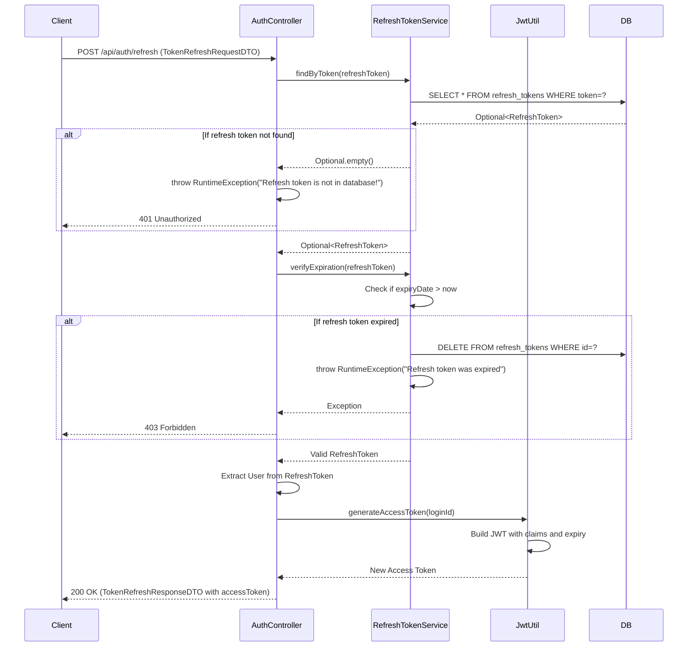

## Token Refresh Sequence Diagram

## 토큰 갱신 (POST `/api/auth/refresh`)

| 항목 | 흐름 요약 | 핵심 비즈니스 로직 |
|:---|:---|:---|
| **목표** | 만료된 Access Token을 Refresh Token으로 재발급 | - |
| **요청 수신** | `Client`가 Refresh Token을 전달하면 `AuthController`는 `TokenRefreshRequestDTO`를 받습니다. | - |
| **Refresh Token 조회** | `RefreshTokenService`가 **DB에서 해당 토큰이 존재하는지** 조회합니다. | **토큰 존재 확인** |
| **토큰 없음 처리** | Refresh Token이 DB에 없으면 **401 Unauthorized**를 반환합니다. | 유효하지 않은 토큰 거부 |
| **만료 검증** | `verifyExpiration`을 통해 **Refresh Token이 만료되지 않았는지** 확인합니다. | **시간 기반 토큰 유효성 검증** |
| **만료 토큰 정리** | Refresh Token이 만료되었으면 **DB에서 삭제**하고 **403 Forbidden**을 반환합니다. | 만료된 토큰 자동 정리 |
| **사용자 정보 추출** | 유효한 Refresh Token에서 **User 정보를 추출**합니다. | - |
| **새로운 Access Token 발급** | `JwtUtil`을 통해 **새로운 JWT Access Token**을 생성합니다. | JWT 재발급 |
| **응답 반환** | 새로운 Access Token을 담은 `TokenRefreshResponseDTO`를 `Client`에게 **HTTP 200 OK** 응답과 함께 반환합니다. | - |