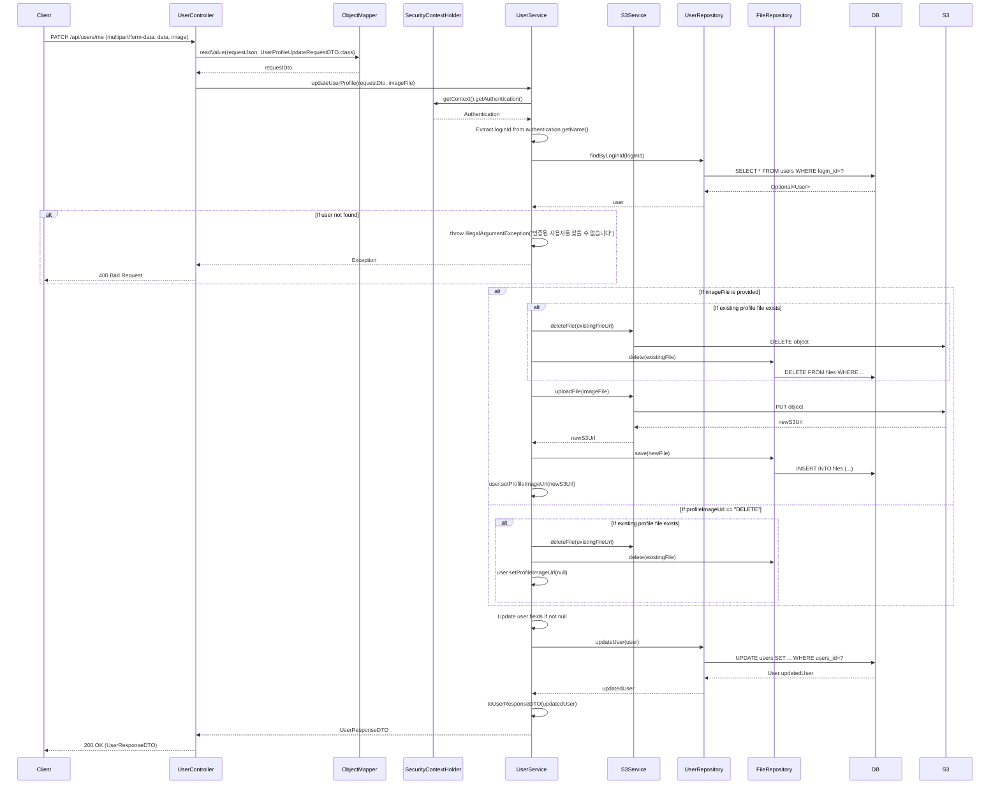

## Update Profile Sequence Diagram

---

## 프로필 수정 (PATCH `/api/users/me`)

| 항목 | 흐름 요약 | 핵심 비즈니스 로직 |
|:---|:---|:---|
| **목표** | 사용자 프로필 정보 수정 | - |
| **요청 형식** | `multipart/form-data`로 JSON 데이터(`data`)와 이미지 파일(`image`)을 함께 전송합니다. | **JSON + 이미지 동시 업로드** |
| **JSON 파싱** | `ObjectMapper`를 사용하여 JSON 문자열을 `UserProfileUpdateRequestDTO`로 변환합니다. | - |
| **요청 수신 및 인증** | `Service`는 `SecurityContextHolder`에서 **인증된 사용자를 식별**합니다. | **본인 인증** |
| **이미지 업로드** | 새 이미지가 제공되면 기존 이미지를 **S3에서 삭제**하고, 새 이미지를 **업로드**합니다. | **S3 이미지 관리** |
| **이미지 삭제** | `profileImageUrl`이 "DELETE"이면 기존 이미지를 삭제하고 URL을 null로 설정합니다. | **이미지 삭제 요청 처리** |
| **필드 업데이트** | `Service`는 **null이 아닌 필드만 선택적으로 업데이트**합니다 (usersName, usersDescription, usersBirthday, gender, profileImageUrl). | **부분 업데이트 (Partial Update)** |
| **데이터 저장** | `Service`는 `UserRepository`를 통해 **변경사항을 DB에 저장**합니다. | 트랜잭션 기반 업데이트 |
| **응답 반환** | `Service`는 업데이트된 사용자 정보를 DTO로 변환하여 `Controller`를 거쳐 `Client`에게 **HTTP 200 OK** 응답과 함께 반환합니다. | - |