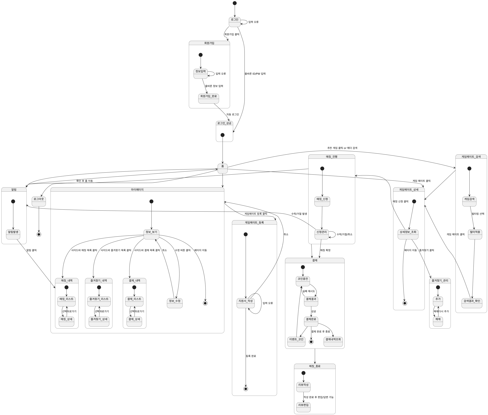

**5. State machine diagram**

이 장은 시스템의 State machine diagram을 그리고 설명한다. 아래 그림은 본 프로젝트에서 제작한 게임 매칭 웹 시스템의 State machine diagram이다.

 
[그림 5-1] State Machine Diagram  

본 상태 다이어그램은 사용자가 웹 서비스 내에서 회원가입부터 매칭 완료, 리뷰 작성까지 거치는 전 과정을 상태(state)와 상태 전이(transition)로 나타낸 것이다. 각 기능은 독립적인 서브 상태(substate)로 구성되어 있으며, 사용자의 주요 행위(클릭, 입력, 결제 등)에 따라 상태가 변화한다. 이를 통해 서비스의 전체 동작 흐름과 사용자 경험(UX) 구조를 시각적으로 표현하였다.

(1) 회원가입 및 로그인 단계 
웹 기능 이용을 위하여 초기상태는 로그인 화면으로 전이된다. 
로그인 화면에서 회원가입을 클릭하면 회원가입 서브 상태로 이동한다.
회원가입 시 입력 오류가 있을 경우 정보입력 상태를 반복하며, 올바른 입력이 완료되면 회원가입_완료 상태를 거쳐 자동 로그인 후 로그인_성공 상태로 진입한다.
로그인 시에도 ID/PW 오류 시 재입력 상태로 반복되며, 성공 시 홈 화면으로 이동한다.

(2) 홈(Home) 상태 
로그인 성공 시 진입하는 기본 화면이다. 
홈에서는 다음의 주요 기능으로 이동할 수 있다. 
● 마이페이지 : 개인 정보 및 이용 내역 확인 
● 게임메이트_검색 : 게임 메이트 탐색 및 상세 보기 
● 알림 : 매칭 관련 알림 확인 
● 게임메이트_상세 : 추천 목록 내 특정 메이트 클릭 시 진입 

(3) 마이페이지(Mypage) 
사용자의 정보 및 활동 내역을 관리하는 영역이다.
기본 상태는 정보_보기이며, 여기서 정보 수정, 즐겨찾기 내역, 결제 내역, 매칭 내역을 확인할 수 있다.
각 내역은 독립된 서브 상태로 구성되어 세부 데이터를 단계적으로 조회할 수 있다. 
● 즐겨찾기_내역: 등록된 메이트 목록 조회 및 상세 보기 
● 결제_내역: 결제 리스트 및 결제 상세 정보 확인 
● 매칭_내역: 과거 매칭 기록 및 상세 내역 확인 
마이페이지에서 다른 페이지로 이동 시 종료 상태로 전이된다.

(4) 게임메이트 등록 
사용자가 자신을 메이트로 등록할 때 진입하는 기능이다.
지원서_작성 단계에서 입력 오류 시 반복되며, 등록 완료 시 종료된다. 취소 시 마이페이지로 복귀한다.

(5) 게임메이트 검색 및 상세 보기 
게임메이트_검색 상태에서 필터를 적용하고 결과를 확인할 수 있다.
검색 결과에서 특정 메이트를 클릭하면 게임메이트_상세 상태로 전이된다.
상세보기에서는 즐겨찾기 등록(즐겨찾기_관리) 또는 매칭 신청(매칭_진행)이 가능하다.
상세 정보 확인 후 페이지를 벗어나면 종료된다.

(6) 매칭 진행 
사용자가 매칭을 신청하면 매칭_진행 상태로 진입한다.
신청관리 상태에서 상대방의 수락 / 거절 / 취소 이벤트가 발생할 수 있으며, 수락 시 결제 단계(결제)로 이동, 거절 또는 취소 시 알림 상태로 전이된다.

(7) 결제(Payment) 
매칭이 확정된 후 사용자는 결제 단계로 진입한다.
코인충전 상태에서 결제 수단 선택 및 결제 금액 입력을 수행한다.
결제 처리 결과(결제결과)에 따라 실패 시 재시도를 수행하며, 성공 시 결제완료 상태로 전이된다.
결제 완료 후에는 결제 내역 조회(결제내역조회) 또는 이벤트 코인 지급(이벤트_코인) 기능을 통해 추가적인 후속 처리가 가능하다.
모든 결제 단계가 완료되면 결제 상태는 종료 상태로 전이되어 다음 프로세스로 연결된다.

(8) 매칭 종료 및 리뷰(Matching End & Review) 
매칭이 완료된 후, 사용자는 매칭_종료 상태에서 리뷰를 작성할 수 있다.
리뷰 작성 후에는 리뷰 편집 상태로 전이되어, 필요 시 작성된 리뷰를 수정하거나 작성된 리뷰에 대해서 답변을 추가할 수 있다.

(9) 알림(Notification) 
매칭 과정에서 상대방의 수락, 거절, 취소 등의 이벤트 발생 시 알림 상태가 트리거된다.
알림 발생 후 사용자가 알림을 클릭하면 관련 매칭 상세 정보(매칭_내역) 페이지로 이동할 수 있다.
알림 확인 후에는 홈 화면으로 복귀하여 사용자가 다른 기능을 계속 이용할 수 있다.

(10) 로그아웃 
로그아웃을 선택하면 모든 시스템 프로세스 세션이 종료된다.
