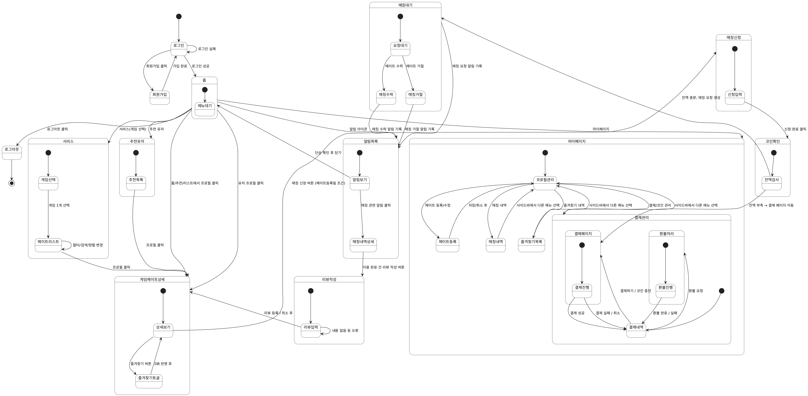

## 5. State Machine Diagram

이 장은 시스템의 State Machine Diagram을 제시하고, 사용자 관점에서 서비스의 주요 상태 전환 흐름을 설명한다.

 

  
**[그림 5-1] State Machine Diagram**

 

본 상태 다이어그램은 사용자가 웹 서비스 내에서 **회원가입 → 로그인 → 게임메이트 검색 → 매칭 요청 → 결제 → 매칭 종료 및 리뷰 작성**에 이르는 전체 과정을 **상태(State)**와 **상태 전이(Transition)**를 통해 표현하였다.  
각 기능은 **독립된 서브 상태(Substate)**로 구성되어 있으며, 사용자의 주요 행위(클릭, 입력, 결제 등)에 따라 상태가 변화한다.  
이를 통해 서비스의 실행 흐름과 사용자 경험 구조를 시각적으로 이해할 수 있다.

---

### (1) 회원가입 및 로그인 단계

- 초기 상태는 로그인 화면이다.
- 로그인 화면에서 **회원가입**을 선택하면 `회원가입` 서브 상태로 전환된다.
- 입력 정보 오류 시 해당 상태를 반복하며, 검증이 완료되면 `회원가입_완료` 및 `로그인_성공` 상태로 전이된다.
- 로그인 시 ID/PW 오류가 발생하면 재입력 상태를 반복하며, 로그인 성공 시 `홈(Home)` 화면으로 이동한다.

---

### (2) 홈(Home)

로그인 직후 진입하는 기본 상태이며, 다음 주요 기능으로 이동할 수 있다.

| 이동 화면 | 설명 |
|----------|------|
| 마이페이지 | 개인 정보 및 활동 내역 확인 |
| 게임메이트 검색 | 메이트 탐색 및 상세 정보 접근 |
| 알림 | 매칭 상태 알림 확인 |
| 게임메이트 상세보기 | 추천/검색된 특정 메이트 클릭 시 진입 |

---

### (3) 마이페이지(Mypage)

사용자의 개인 정보와 이용 기록을 확인·관리하는 상태이다.

| 서브 상태 | 설명 |
|----------|------|
| 정보_보기 | 사용자 기본 정보 확인 및 수정 |
| 즐겨찾기_내역 | 등록한 메이트 목록 조회 및 상세 보기 |
| 결제_내역 | 결제 기록 및 상세 정보 확인 |
| 매칭_내역 | 과거 매칭 및 세부 내역 조회 |

다른 화면으로 이동 시 마이페이지 상태는 종료된다.

---

### (4) 게임메이트 등록

- 사용자가 자신을 메이트로 등록할 때 진입하는 상태이다.
- `지원서_작성` 단계에서 오류 발생 시 반복 입력한다.
- 등록 완료 시 종료되며, 취소 시 `마이페이지`로 복귀한다.

---

### (5) 게임메이트 검색 및 상세 보기

- 사용자는 검색 조건(게임, 티어, 시간대 등)을 적용하여 메이트 목록을 조회한다.
- 특정 메이트를 선택하면 `게임메이트_상세` 상태로 전이된다.
- 상세 보기 화면에서 가능한 행동:
  - **즐겨찾기 등록** (`즐겨찾기_관리`)
  - **매칭 신청 진행** (`매칭_진행`)

---

### (6) 매칭 진행

| 상태 변화 조건 | 다음 상태 |
|---------------|----------|
| 메이트가 매칭을 수락 | 결제 단계(`결제`) |
| 메이트가 거절 | 알림 상태(`알림`) |
| 사용자가 요청 취소 | 알림 상태(`알림`) |

---

### (7) 결제(Payment)

- 매칭 확정 후 진입하는 단계이다.
- `코인충전` → 결제 수단 선택 → 결제 수행 과정을 포함한다.
- 결제 성공 시 `결제완료` 상태로 이동한다.
- 결제 실패 시 재시도 또는 취소가 가능하다.

---

### (8) 매칭 종료 및 리뷰(Matching End & Review)

- 매칭이 종료된 후 사용자에게 리뷰 작성 옵션이 제공된다.
- 리뷰 작성 후 필요 시 수정(`리뷰_편집`) 또는 메이트 측 답변(`리뷰_답변`)이 가능하다.

---

### (9) 알림(Notification)

- 수락/거절/취소 등의 매칭 이벤트 발생 시 시스템에서 알림 상태가 트리거된다.
- 사용자가 알림을 클릭하면 `매칭_내역` 상세 페이지로 이동한다.
- 알림 확인 후 홈으로 복귀한다.

---

### (10) 로그아웃

- 사용자가 로그아웃을 선택하면 모든 세션이 종료되고 초기 상태로 되돌아간다.

---

