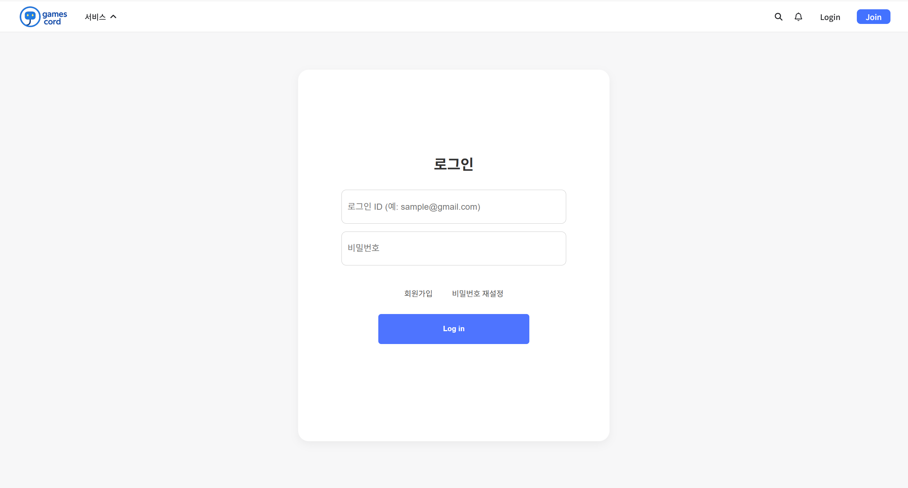
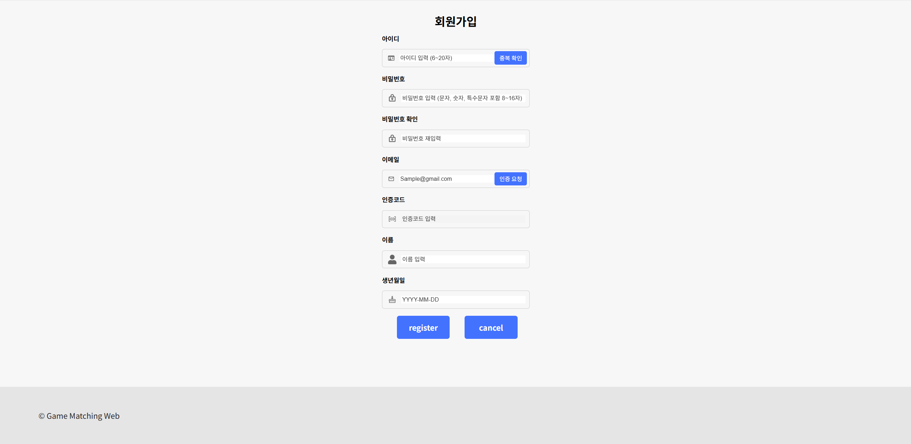
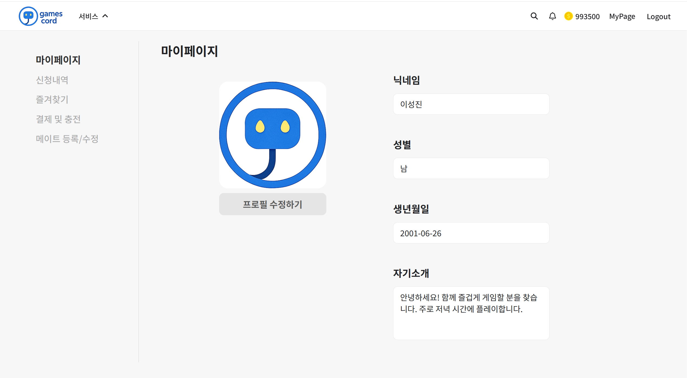
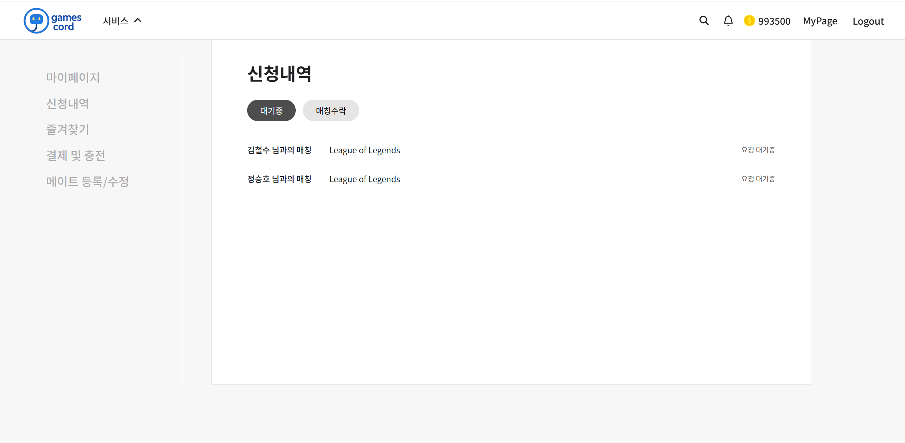
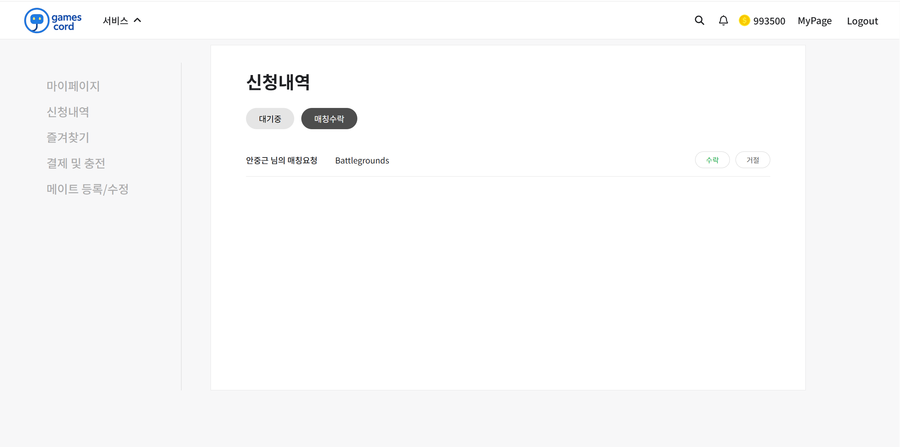
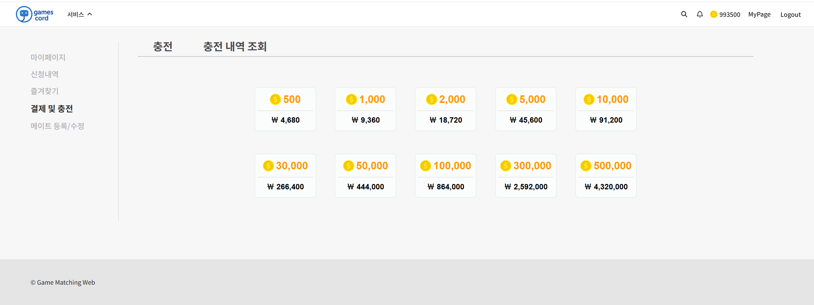
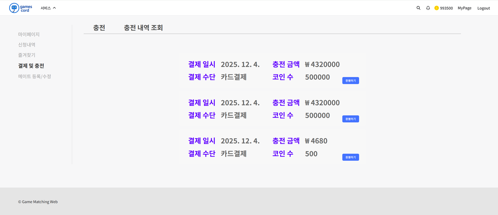
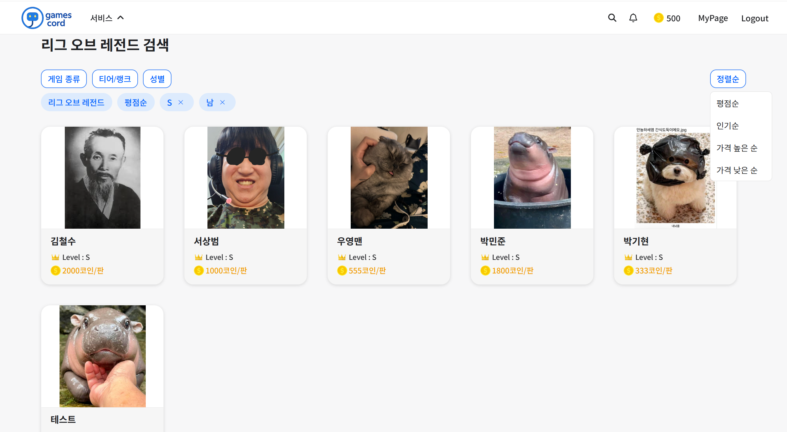

# 6. User Interface Prototype

이 장은 개발 완료 시 구성될 예상 UI와 각 구성 요소에 대한 설명으로 이루어져 있다.

---

### 그림 [6-1] 로그인 화면

해당 화면은 로그인 화면이다. 사용자는 아이디와 비밀번호를 입력하여 로그인할 수 있으며, 신규 회원을 위한 회원가입 기능과 비밀번호를 잊었을 경우 비밀번호 재설정 기능을 제공한다.

---

### 그림 [6-2] 헤더

.png>)

.png>)

헤더는 모든 화면 상단에 항상 표시되며, 사용자에게 자주 사용되는 기능에 빠르게 접근할 수 있도록 구성되어 있다.  
Logo 버튼 클릭 시 홈 화면으로 이동하며, 매칭 유저 검색, 로그인, 회원가입 기능을 제공한다.  
로그인 이후에는 코인 아이콘과 Login / Join 버튼이 사용자의 정보가 표시되는 형태로 변경된다.

---

### 그림 [6-3] 회원가입 화면

회원가입 화면에서는 아이디, 비밀번호, 이메일, 인증코드, 이름, 생년월일을 입력하여 회원가입할 수 있다.  
비밀번호 확인 입력란을 두어 오입력을 방지하였으며, 아이디 중복 확인 기능을 통해 중복된 아이디 사용을 방지하고 악의적인 회원가입을 방지하기 위해서 이메일 인증을 통해서 인증코드를 입력하게 하였다.

---

### 그림 [6-4] 홈 화면

.png>)

.png>)

홈 화면에서는 추천 서비스 탭에서 게임을 선택하여 해당 게임별 메이트 공고 페이지로 이동할 수 있다.  
또한 추천 유저 탭에서는 인기있는 메이트 유저 목록을 제공하며, 프로필 박스를 클릭하면 해당 유저의 공고 상세 페이지로 이동한다.

---

### 그림 [6-5] 마이페이지

마이페이지에서는 회원가입 시 등록한 사용자 정보를 확인하고 수정할 수 있다.  
좌측 상단 탭을 사용하여 신청 내역 페이지와 즐겨찾기, 결제 및 충전, 메이트등록/수정 페이지로 이동할 수 있다.

---

### 그림 [6-6] 신청내역 - 대기중 화면

해당 화면에서는 사용자가 다른 메이트 유저에게 신청한 매칭의 상태를 확인할 수 있다.  
각 매칭 요청은 신청한 유저의 닉네임과 함께 요청 대기중 상태로 표시된다.

---

### 그림 [6-7] 신청내역 - 매칭 수락 화면

해당 화면은 메이트 공고를 올린 유저가 받은 매칭 요청 목록을 확인하는 화면이다.  
요청자 닉네임과 함께 `수락` 및 `거절` 버튼을 제공하여 각 요청에 대해 응답할 수 있다.

---

### 그림 [6-8] 게임메이트 등록/수정 화면

.png>)

.png>)

사용자는 자신을 나타낼 수 있는 프로필 이미지, 소개글, 이용 가능 시간대, 게임별 요금을 등록할 수 있다.  
또한 게임별 티어 선택 기능을 통해 자신의 실력을 인증할 수 있다.

---

### 그림 [6-9] 게임메이트 상세 화면

.png>)

.png>)

등록된 정보(프로필, 요금, 소개)를 기반으로 메이트 상세 공고가 작성된다.  
게임을 함께 플레이한 유저는 리뷰를 남길 수 있으며, 별점(5점 만점)과 리뷰 목록을 확인할 수 있다.

---

### 그림 [6-10] 코인 충전 화면

해당 화면에서는 사용자가 원하는 코인 충전량을 선택하여 코인을 충전할 수 있다.

---

### 그림 [6-11] 결제 화면

.png>)

.png>)

충전 선택 후 결제 화면으로 전환되며 카드 결제, 계좌 이체, 간편 결제 등 원하는 수단으로 선택하면 팝업창이 뜨며 결제 정보를 확인한 후에 결제를 진행할 수 있다.

---

### 그림 [6-12] 충전 내역 조회

충전 내역 조회 화면에서는 결제 일시, 충전 금액, 결제 수단, 충전된 코인 수 등의 상세 내역을 확인할 수 있다.

### 그림 [6-13] 즐겨찾기

.png>)

.png>)

즐겨찾기 페이지에서는 사용자가 즐겨찾기 해놓은 유저 목록을 확인 할 수 있다.

### 그림 [6-14] 알림

.png>)

.png>)

헤더에서는 상대방이 매칭을 수락을 했는지 안했는지 알림이 확인이 가능하며 알림이 왔다면 알림 옆에 숫자가 표시가 된다.

### 그림 [6-15] 게임 메이트 검색

사용자가 게임 종류, 평점순, 인기순, 가격 높은 순, 가격 낮은 순, 성별, 티어/랭크 순 등으로 필터링할 수 있다.
