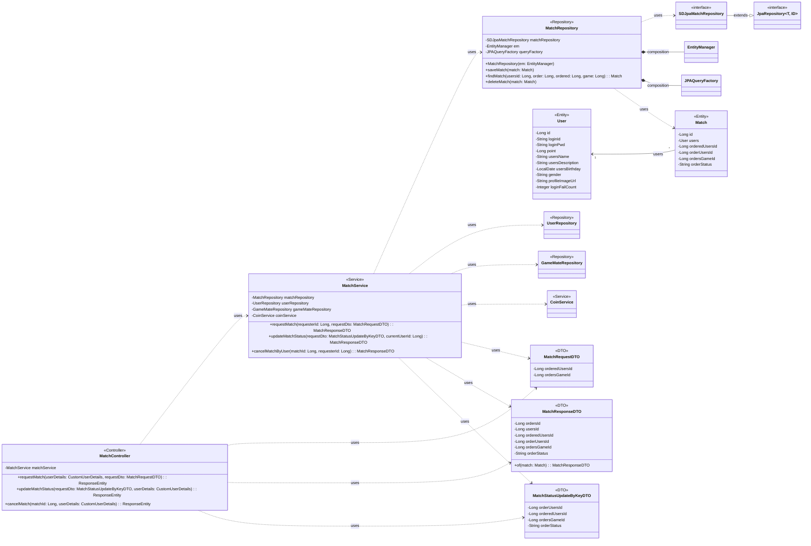

## Match 클래스 정보

| 구분             | Name           | Type   | Visibility | Description                                                |
|:---------------|:---------------|:-------|:-----------|:-----------------------------------------------------------|
| **class**      | **Match**      |        |            | 데이터베이스의 matches 테이블과 매핑되는 JPA 객체                           |
| **Attributes** | id             | Long   | private    | DB의 PK로서 orders_id 컬럼과 매핑되는 변수                             |
|                | users          | User   | private    | DB의 users_id 컬럼과 매핑되는 변수로 User의 정보를 받아오기 위한 변수             |
|                | orderedUsersId | Long   | private    | DB의 ordered_users_id 컬럼과 매핑되는 변수로 매칭 주문을 받은 사용자ID를 저장하는 변수 |
|                | orderUsersId   | Long   | private    | DB의 order_users_id 컬럼과 매핑되는 변수로 매칭 주문을 한 사용자ID를 저장하는 변수    |
|                | ordersGameId   | Long   | private    | DB의 orders_game_id 컬럼과 매핑되는 변수로 매칭된 게임ID를 저장하는 변수          |
|                | orderStatus    | String | private    | DB의 order_status 컬럼과 매핑되는 변수로 매칭 주문의 수락 여부를 저장하는 변수        |

## MatchRepository 클래스 정보

| 구분             | Name                | Type                 | Visibility | Description                                            |
|:---------------|:--------------------|:---------------------|:-----------|:-------------------------------------------------------|
| **class**      | **MatchRepository** |                      |            | DB에 저장된 사용자와 게임메이트 사이에 매칭 정보를 생성, 수정, 삭제, 조회를 위한 class |
| **Attributes** | matchRepository     | SDJpaMatchRepository | private    | 생성, 수정, 삭제, 조회 쿼리를 쉽게 사용하기 위한 Spring Data JPA          |
|                | em                  | EntityManager        | private    | 엔티티 객체를 관리해주는 객체                                       |
|                | queryFactory        | JPAQueryFactory      | private    | Query DSL 기능을 사용하기 위한 객체                               |
| **Operations** | MatchRepository     | void                 | public     | matchRepository 클래스 생성 및 초기화하는 생성자                     |
|                | saveMatch           | void                 | public     | 매칭 정보를 DB에 저장하는 함수                                     |
|                | findMatch           | Match                | public     | DB에 저장된 사용자와 게임메이트 사이에 매칭 정보를 조회하여 반환하는 함수             |
|                | deleteMatch         | void                 | public     | 매칭 정보를 DB에서 삭제하는 함수                                    |

## MatchController 클래스 정보

| 구분             | Name                | Type                             | Visibility | Description                                                      |
|:---------------|:--------------------|:---------------------------------|:-----------|:-----------------------------------------------------------------|
| **class**      | **MatchController** |                                  |            | 매칭 관련 HTTP 요청을 처리하는 REST 컨트롤러. 클라이언트의 요청을 받아 MatchService로 전달    |
| **Attributes** | matchService        | MatchService                     | private    | 매칭 비즈니스 로직을 처리하는 서비스 객체. MatchController의 핵심 로직을 위임받아 처리         |
| **Operations** | requestMatch        | ResponseEntity<MatchResponseDTO> | public     | 새로운 매칭을 요청하는 API 엔드포인트. 요청 DTO와 인증된 사용자 정보를 받아 MatchService에 전달  |
|                | updateMatchStatus   | ResponseEntity<MatchResponseDTO> | public     | 매칭 상태를 업데이트하는 API 엔드포인트. 요청 DTO와 인증된 사용자 정보를 받아 MatchService에 전달 |
|                | cancelMatch         | ResponseEntity<MatchResponseDTO> | public     | 매칭을 취소하는 API 엔드포인트. 매칭 ID와 인증된 사용자 정보를 받아 MatchService에 전달       |

## MatchService 클래스 정보

| 구분             | Name               | Type               | Visibility | Description                                                        |
|:---------------|:-------------------|:-------------------|:-----------|:-------------------------------------------------------------------|
| **class**      | **MatchService**   |                    |            | 매칭 관련 비즈니스 로직을 처리하는 서비스 객체. 데이터베이스와 상호작용하며 핵심 기능을 수행               |
| **Attributes** | matchRepository    | MatchRepository    | private    | 매칭 정보(Match 엔티티)에 대한 데이터베이스 연산을 담당하는 리포지토리 객체                      |
|                | userRepository     | UserRepository     | private    | 사용자 정보(User 엔티티)에 대한 데이터베이스 연산을 담당하는 리포지토리 객체                      |
|                | gameMateRepository | GameMateRepository | private    | 게임메이트 정보(Gamemate 엔티티)에 대한 데이터베이스 연산을 담당하는 리포지토리 객체                |
|                | coinService        | CoinService        | private    | 코인 관련 비즈니스 로직을 처리하는 서비스 객체                                         |
| **Operations** | requestMatch       | MatchResponseDTO   | public     | 새로운 매칭을 요청하는 비즈니스 로직. 코인 차감, 매칭 정보 저장 등의 작업을 수행                    |
|                | updateMatchStatus  | MatchResponseDTO   | public     | 매칭 상태를 업데이트하는 비즈니스 로직. 매칭 수락 시 코인 지급, 거절 시 코인 환불 및 매칭 삭제 등의 작업을 수행 |
|                | cancelMatchByUser  | MatchResponseDTO   | public     | 사용자가 매칭을 취소하는 비즈니스 로직. 코인 환불 및 매칭 삭제 등의 작업을 수행                     |

## MatchRequestDTO 클래스 정보

| 구분             | Name                | Type | Visibility | Description                     |
|:---------------|:--------------------|:-----|:-----------|:--------------------------------|
| **class**      | **MatchRequestDTO** |      |            | 매칭 요청 시 클라이언트로부터 받는 데이터를 담는 DTO |
| **Attributes** | orderedUsersId      | Long | private    | 매칭을 요청받은 게임메이트의 사용자 ID          |
|                | ordersGameId        | Long | private    | 매칭 요청된 게임의 ID                   |

## MatchResponseDTO 클래스 정보

| 구분             | Name                 | Type             | Visibility | Description                                  |
|:---------------|:---------------------|:-----------------|:-----------|:---------------------------------------------|
| **class**      | **MatchResponseDTO** |                  |            | 매칭 정보를 클라이언트에 응답할 때 사용하는 DTO                 |
| **Attributes** | ordersId             | Long             | private    | 매칭의 고유 ID                                    |
|                | usersId              | Long             | private    | 매칭을 요청한 사용자의 ID                              |
|                | orderedUsersId       | Long             | private    | 매칭을 요청받은 게임메이트의 사용자 ID                       |
|                | orderUsersId         | Long             | private    | 매칭을 요청한 사용자의 ID (usersId와 동일)                |
|                | ordersGameId         | Long             | private    | 매칭된 게임의 ID                                   |
|                | orderStatus          | String           | private    | 매칭의 현재 상태 (예: PENDING, ACCEPTED, DECLINED)   |
| **Operations** | of                   | MatchResponseDTO | public     | Match 엔티티를 MatchResponseDTO로 변환하는 정적 팩토리 메서드 |

## MatchStatusUpdateByKeyDTO 클래스 정보

| 구분             | Name                          | Type   | Visibility | Description                             |
|:---------------|:------------------------------|:-------|:-----------|:----------------------------------------|
| **class**      | **MatchStatusUpdateByKeyDTO** |        |            | 매칭 상태 업데이트 요청 시 클라이언트로부터 받는 데이터를 담는 DTO |
| **Attributes** | orderUsersId                  | Long   | private    | 매칭을 요청한 사용자의 ID                         |
|                | orderedUsersId                | Long   | private    | 매칭을 요청받은 게임메이트의 사용자 ID                  |
|                | ordersGameId                  | Long   | private    | 매칭 요청된 게임의 ID                           |
|                | orderStatus                   | String | private    | 업데이트할 매칭 상태 (예: ACCEPTED, DECLINED)     |