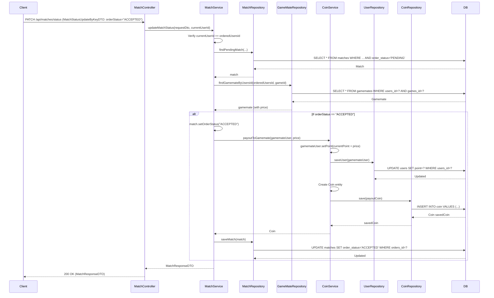

## 매칭 수락 시 게임메이트 코인 지급 (내부 메서드)

| 항목 | 흐름 요약 | 핵심 비즈니스 로직 |
|:---|:---|:---|
| **목표** | 매칭 수락 시 게임메이트에게 코인을 지급하고 거래 내역 기록 | - |
| **호출 시점** | `MatchService.updateMatchStatus()`에서 게임메이트가 매칭을 **ACCEPTED**로 변경할 때 호출됩니다. | - |
| **권한 확인** | 매칭 상태 변경은 **게임메이트(orderedUsersId)만 가능**합니다. | **게임메이트만 수락/거절 가능** |
| **포인트 증가** | `CoinService.payoutToGamemate()`는 게임메이트의 **point를 매칭 가격만큼 증가**시키고 `UserRepository`를 통해 **UPDATE**를 요청합니다. | **포인트 지급** |
| **거래 기록** | `Service`는 `Coin` 엔티티를 생성하여 **지급 내역을 DB에 INSERT**합니다. | **거래 이력 저장** (coinAmount: 양수, paymentMethod: "GAMEMATE_PAYOUT") |
| **매칭 상태 변경** | `MatchService`는 매칭 상태를 **"ACCEPTED"로 업데이트**합니다. | 매칭 완료 처리 |
