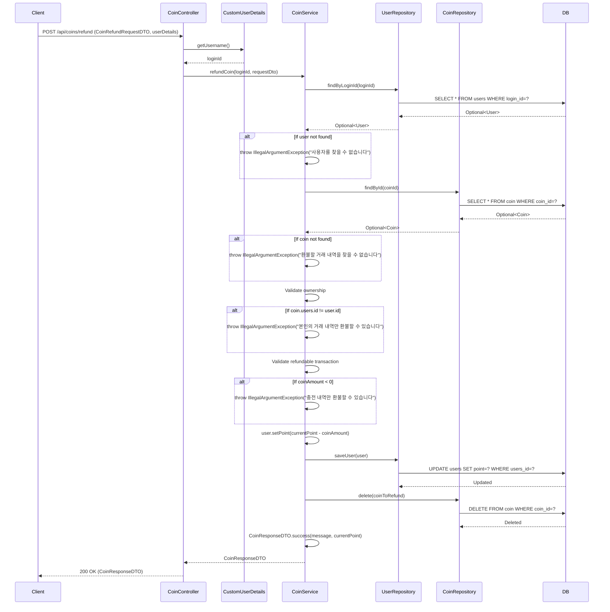

## 코인 환불 (POST `/api/coins/refund`)

| 항목 | 흐름 요약 | 핵심 비즈니스 로직 |
|:---|:---|:---|
| **목표** | 충전한 코인 환불 및 거래 내역 삭제 | - |
| **요청 수신 및 인증** | `Client`가 환불할 coinId를 전달하면 `Controller`는 `CustomUserDetails`를 통해 **인증된 사용자를 식별**합니다. | - |
| **사용자 조회** | `CoinService`는 `UserRepository`의 `findByLoginId`를 통해 **loginId로 현재 사용자를 조회**합니다. | 사용자 존재 확인 (예외 처리) |
| **거래 내역 조회** | `Service`는 `CoinRepository`의 `findById`를 통해 **coinId로 환불 대상 거래를 조회**합니다. | 거래 존재 확인 (예외 처리) |
| **소유권 검증** | `Service`는 거래 내역의 소유자(coin.users.id)와 **현재 사용자(user.id)가 일치하는지** 확인합니다. | **본인 거래만 환불 가능** (예외 처리) |
| **환불 가능 여부 확인** | `Service`는 **coinAmount가 양수인지** 확인합니다 (양수: 충전 내역, 음수: 사용 내역). | **충전 내역만 환불 가능** (예외 처리) |
| **포인트 차감** | `Service`는 사용자의 **point를 환불 금액만큼 차감**하고 `UserRepository`를 통해 **UPDATE**를 요청합니다. | 포인트 복원 |
| **거래 삭제** | `Service`는 `CoinRepository`를 통해 **환불된 거래 내역을 DB에서 DELETE**합니다. | **거래 이력 삭제** |
| **응답 반환** | `Service`는 환불 완료 메시지와 현재 잔액을 DTO로 변환하여 `Controller`를 거쳐 `Client`에게 **HTTP 200 OK** 응답과 함께 반환합니다. | - |