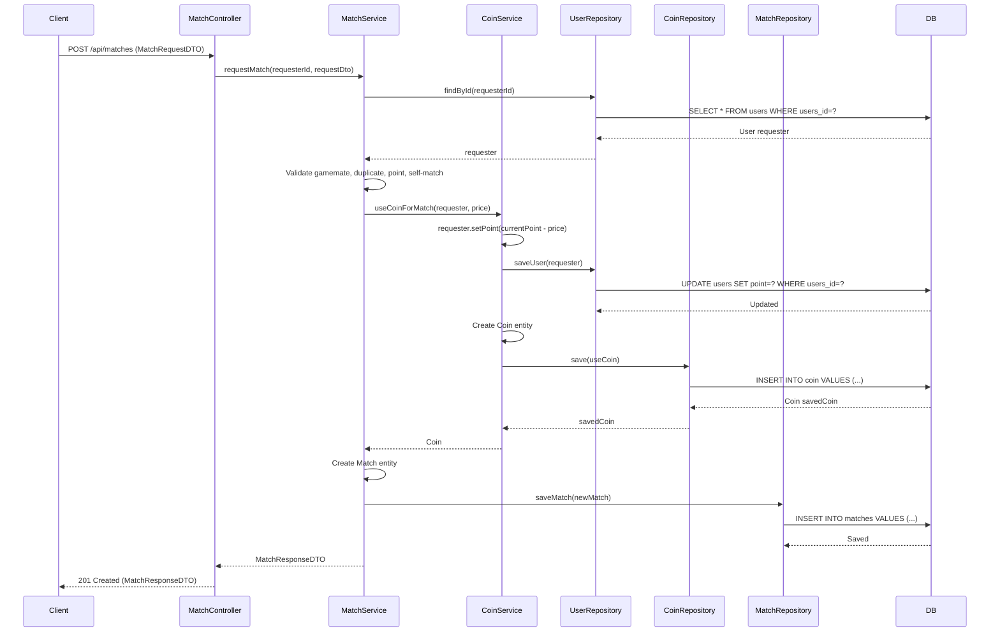

## 매칭 요청 시 코인 차감 (내부 메서드)

| 항목 | 흐름 요약 | 핵심 비즈니스 로직 |
|:---|:---|:---|
| **목표** | 매칭 요청 시 요청자의 코인을 차감하고 거래 내역 기록 | - |
| **호출 시점** | `MatchService.requestMatch()`에서 매칭 요청이 유효성 검증을 통과한 후 호출됩니다. | - |
| **유효성 검증** | 게임메이트 조회, 중복 확인, 포인트 부족 확인, 자가 매칭 방지 등을 수행합니다. | 비즈니스 규칙 검증 |
| **포인트 차감** | `CoinService.useCoinForMatch()`는 요청자의 **point를 매칭 가격만큼 차감**하고 `UserRepository`를 통해 **UPDATE**를 요청합니다. | **포인트 차감** |
| **거래 기록** | `Service`는 `Coin` 엔티티를 생성하여 **사용 내역을 DB에 INSERT**합니다 (coinAmount: 음수, paymentMethod: "MATCH_PENDING"). | **거래 이력 저장** |
| **매칭 생성** | `MatchService`는 Match 엔티티를 생성하고 DB에 저장합니다 (orderStatus: "PENDING"). | 매칭 레코드 생성 |
| **반환** | 저장된 `Coin` 엔티티를 반환하지만 `MatchService`는 이를 사용하지 않습니다. | - |
```
