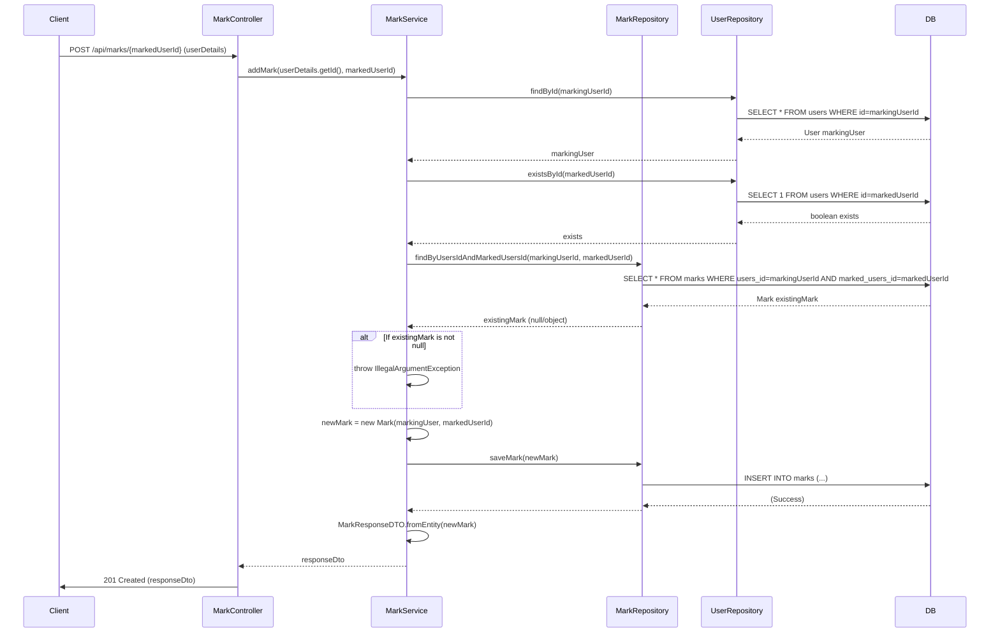

## markAddSequence sequence diagram

## 1. 즐겨찾기 추가 (POST `/api/marks/{markedUserId}`)

| 항목             | 흐름 요약                                                                                                | 핵심 비즈니스 로직            |
|:---------------|:-----------------------------------------------------------------------------------------------------|:----------------------|
| **목표**         | 특정 사용자를 즐겨찾기에 추가                                                                                     | 중복 추가 방지              |
| **요청 수신 및 인증** | `Client` 요청 수신 후, `Controller`는 `userDetails`를 통해 **사용자 ID를 추출**하여 `Service`로 전달합니다.                 | -                     |
| **필수 데이터 확인**  | `MarkService`는 `UserRepository`를 통해 즐겨찾기할 사용자의 존재 유무를 확인합니다.                                         | 유효성 검사 (사용자 존재)       |
| **중복 등록 방지**   | `Service`는 `MarkRepository`의 `findByUsersIdAndMarkedUsersId`를 호출하여 **해당 조합의 레코드가 이미 DB에 있는지** 확인합니다. | **중복 레코드 확인** (예외 처리) |
| **데이터 저장**     | 중복이 없으면, `Service`는 새 `Mark` 엔티티를 생성하고, `MarkRepository`를 통해 DB에 **INSERT**를 요청합니다.                  | 트랜잭션 기반 데이터 저장        |
| **응답 반환**      | `Service`는 저장된 엔티티를 DTO로 변환하여 `Controller`를 거쳐 `Client`에게 **HTTP 201 Created** 응답과 함께 반환합니다.         | -                     |