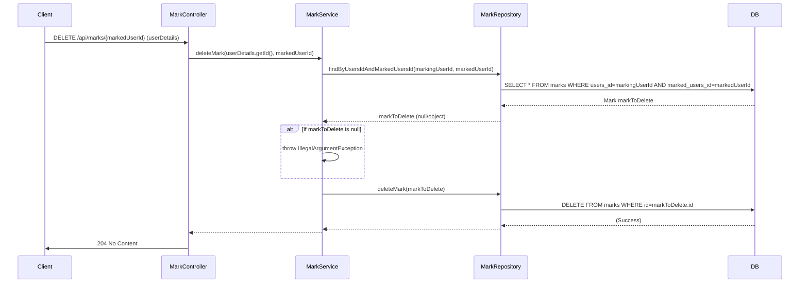

## markDeleteSequence sequence diagram

## 3. 즐겨찾기 삭제 (DELETE `/api/marks/{markedUserId}`)

| 항목             | 흐름 요약                                                                                | 핵심 비즈니스 로직               |
|:---------------|:-------------------------------------------------------------------------------------|:-------------------------|
| **목표**         | 특정 사용자를 즐겨찾기에서 삭제                                                                    | -                        |
| **요청 수신 및 인증** | `Client` 요청 수신 후, `Controller`는 `userDetails`를 통해 **사용자 ID를 추출**하여 `Service`로 전달합니다. | -                        |
| **삭제 대상 확인**   | `MarkService`는 `MarkRepository`를 통해 삭제할 `Mark` 엔티티가 DB에 존재하는지 확인합니다.                 | -                        |
| **데이터 삭제**     | `Service`는 조회된 `Mark` 엔티티를 `MarkRepository`에 전달하여 DB에서 **DELETE**를 요청합니다.            | **레코드 존재 여부 확인** (예외 처리) |
| **응답 반환**      | `Controller`는 별도의 콘텐츠 없이 `Client`에게 **HTTP 204 No Content** 응답을 반환합니다.               | -                        |