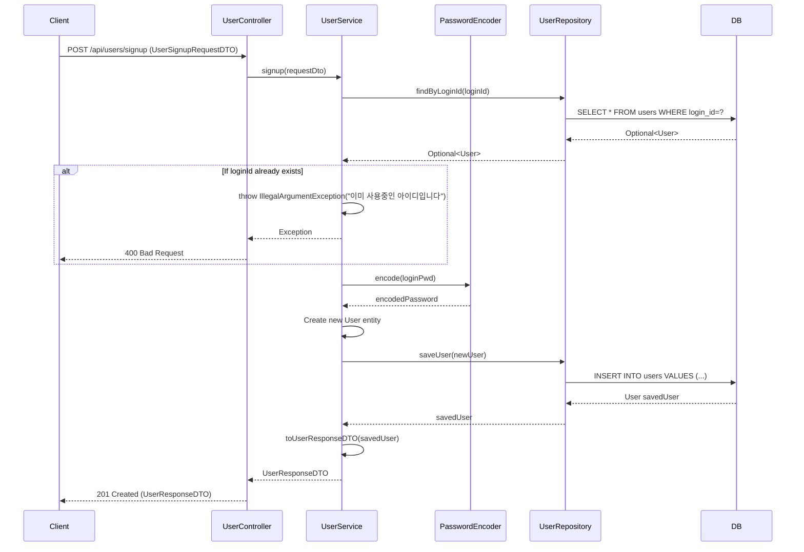

## 회원가입 (POST `/api/users/signup`)

| 항목 | 흐름 요약 | 핵심 비즈니스 로직 |
|:---|:---|:---|
| **목표** | 새로운 사용자 계정 생성 | - |
| **요청 수신 및 검증** | `Client`가 회원가입 정보를 전달하면 `Controller`는 `UserSignupRequestDTO`를 통해 **입력값을 검증**하여 `Service`로 전달합니다. | DTO Validation (loginId 4-255자, loginPwd 6-255자 등) |
| **중복 확인** | `UserService`는 `UserRepository`의 `findByLoginId`를 호출하여 **해당 loginId가 이미 DB에 존재하는지** 확인합니다. | **중복 아이디 검증** (예외 처리) |
| **비밀번호 암호화** | `PasswordEncoder`를 사용하여 평문 비밀번호를 **암호화**합니다. | 보안을 위한 비밀번호 해싱 |
| **사용자 생성** | `User` 엔티티를 생성하고 **기본값을 설정**합니다 (gender="None", point=0, loginFailCount=0). | 초기값 설정 |
| **데이터 저장** | `Service`는 `UserRepository`를 통해 DB에 **INSERT**를 요청합니다. | 트랜잭션 기반 데이터 저장 |
| **응답 반환** | `Service`는 저장된 엔티티를 DTO로 변환하여 `Controller`를 거쳐 `Client`에게 **HTTP 201 Created** 응답과 함께 반환합니다. | - |