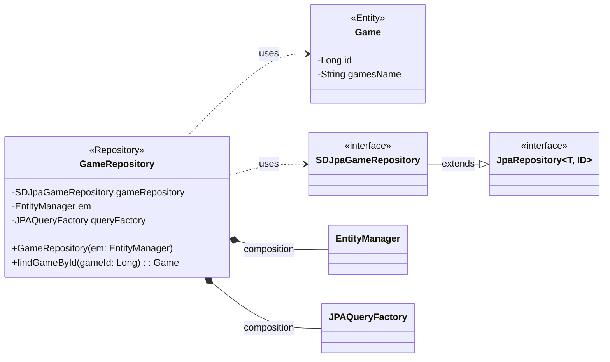

## game class diagram

## GameRepository 클래스 정보

| 구분             | Name               | Type                | Visibility | Description                                   |
|:---------------|:-------------------|:--------------------|:-----------|:----------------------------------------------|
| **class**      | **GameRepository** |                     |            | 서비스에서 제공하는 게임 정보를 DB에서 조회하기 위한 class          |
| **Attributes** | gameRepository     | SDJpaGameRepository | private    | 생성, 수정, 삭제, 조회 쿼리를 쉽게 사용하기 위한 Spring Data JPA |
|                | em                 | EntityManager       | private    | 엔티티 객체를 관리해주는 객체                              |
|                | queryFactory       | JPAQueryFactory     | private    | Query DSL 기능을 사용하기 위한 객체                      |
| **Operations** | GameRepository     | void                | public     | GameRepository 클래스 생성 및 초기화하는 생성자             |
|                | findGameById       | Game                | public     | DB에 저장된 게임 정보를 게임ID를 통해 조회하여 반환하는 함수          |
