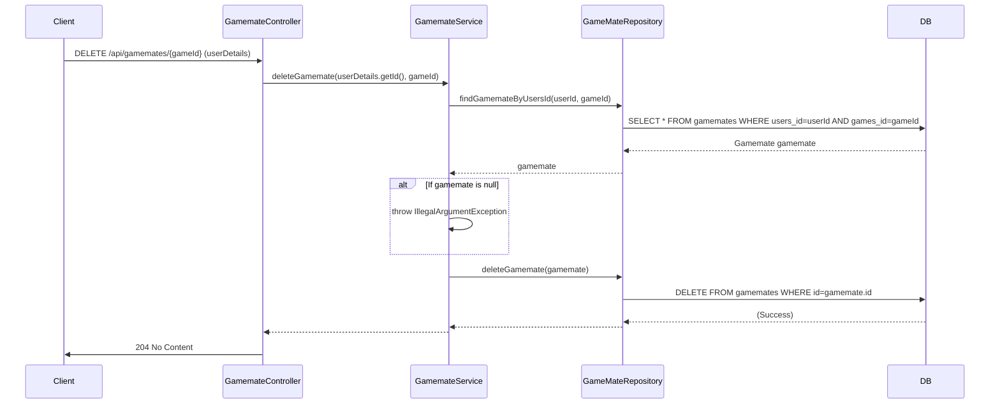

## gamemateDelete sequence diagram

## 4. 게임메이트 삭제 (DELETE `/api/gamemates/{gameId}`)

| 항목             | 흐름 요약                                                                                                  | 핵심 비즈니스 로직        |
|:---------------|:-------------------------------------------------------------------------------------------------------|:------------------|
| **목표**         | 특정 게임에 대한 게임메이트 등록 삭제                                                                                  | -                 |
| **요청 수신 및 인증** | `Client`가 `gameId`와 함께 `Controller`에 삭제를 요청하면, `Controller`는 인증 정보에서 `userId`를 추출하여 `Service`로 전달합니다.  | -                 |
| **삭제 대상 조회**   | `Service`는 `GameMateRepository`를 통해 `userId`와 `gameId`에 해당하는 `Gamemate` 엔티티를 조회합니다.                    | **삭제할 레코드 존재 확인** |
| **데이터 삭제**     | `Service`는 조회된 `Gamemate` 엔티티를 `GameMateRepository`에 전달하여 DB에서 **DELETE**를 요청합니다. 레코드가 없으면 예외를 발생시킵니다. | 트랜잭션 기반 데이터 삭제    |
| **응답 반환**      | `Controller`는 별도의 콘텐츠 없이 `Client`에게 **HTTP 204 No Content** 응답을 반환합니다.                                 | -                 |
