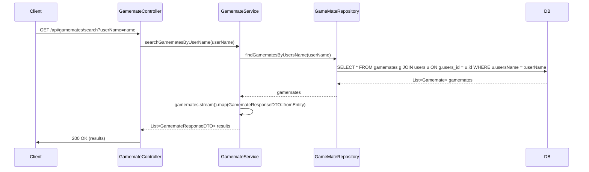

## gamemateSearch sequence diagram

## 2. 게임메이트 검색 (GET `/api/gamemates/search`)

| 항목                   | 흐름 요약                                                                                                                                                  | 핵심 비즈니스 로직                        |
|:---------------------|:-------------------------------------------------------------------------------------------------------------------------------------------------------|:----------------------------------|
| **목표**               | 사용자 이름 기반으로 등록된 게임메이트 목록 검색                                                                                                                            |
| **요청 수신**            | `Client`가 `userName` 쿼리 파라미터와 함께 `Controller`에 요청합니다.                                                                                                  | -                                 |
| **Service 호출**       | `Controller`는 요청을 **읽기 전용 트랜잭션**이 설정된 `GamemateService`로 전달합니다.                                                                                        | `@Transactional(readOnly = true)` |
| **DB 조회 (Querydsl)** | `Service`는 `GameMateRepository`의 `findGamematesByUsersName`을 호출합니다. Repository는 **Querydsl**을 사용하여 `userName`과 일치하는 모든 `Gamemate` 레코드를 **DB에서 조회**합니다. | 사용자 이름 기반 JOIN 및 필터링              |
| **데이터 변환**           | `Service`는 조회된 `List<Gamemate>`를 **스트림 처리**하여 `List<GamemateResponseDTO>`로 변환합니다.                                                                      | 엔티티 to DTO 매핑                     |
| **응답 반환**            | `Controller`는 변환된 DTO 목록을 `Client`에게 **HTTP 200 OK** 응답으로 전달합니다.                                                                                       | -                                 |
