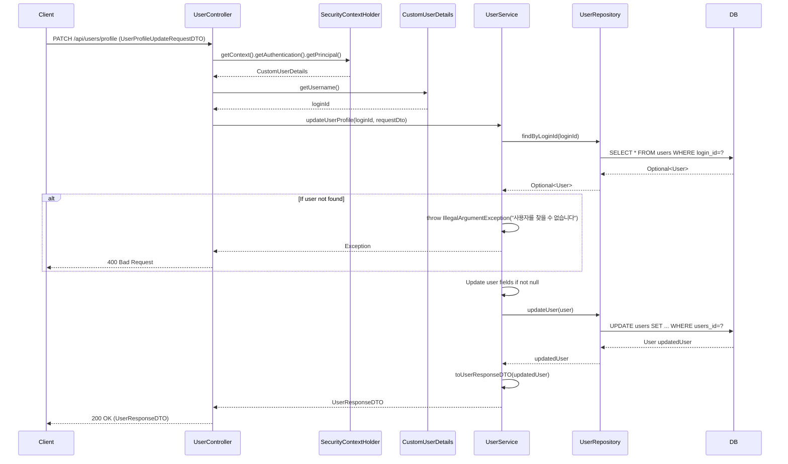

## 프로필 수정 (PATCH `/api/users/profile`)

| 항목 | 흐름 요약 | 핵심 비즈니스 로직 |
|:---|:---|:---|
| **목표** | 사용자 프로필 정보 수정 | - |
| **요청 수신 및 인증** | `Client`가 수정할 정보를 전달하면 `Controller`는 `SecurityContextHolder`에서 **인증된 사용자를 식별**합니다. | **본인 인증** |
| **사용자 조회** | `UserService`는 `UserRepository`의 `findByLoginId`를 통해 **loginId로 현재 사용자를 조회**합니다. | 사용자 존재 확인 (예외 처리) |
| **필드 업데이트** | `Service`는 **null이 아닌 필드만 선택적으로 업데이트**합니다 (usersName, usersDescription, usersBirthday, gender, profileImageUrl). | **부분 업데이트 (Partial Update)** |
| **데이터 저장** | `Service`는 `UserRepository`를 통해 **변경사항을 DB에 저장**합니다. | 트랜잭션 기반 업데이트 |
| **응답 반환** | `Service`는 업데이트된 사용자 정보를 DTO로 변환하여 `Controller`를 거쳐 `Client`에게 **HTTP 200 OK** 응답과 함께 반환합니다. | - |
